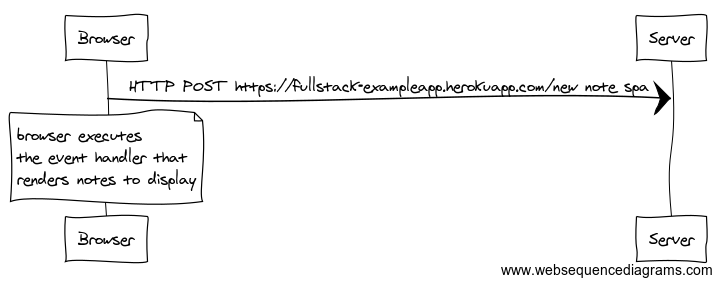

## 0.4
```
Browser->Server: HTTP POST https://fullstack-exampleapp.herokuapp.com/new_note
note over Browser
    redirect to notes
end note
Browser->Server: HTTP GET https://fullstack-exampleapp.herokuapp.com/notes
Server-->Browser: HTML code
Browser->Server: HTTP GET https://fullstack-exampleapp.herokuapp.com/main.css
Server-->Browser: main.css
Browser->Server: HTTP GET https://fullstack-exampleapp.herokuapp.com/main.js
Server-->Browser: main.js
note over Browser
    browser starts executing 
    js-code that requests JSON 
    data from server
end note
Browser->Server: HTTP GET https://fullstack-exampleapp.herokuapp.com/data.json
Server-->Browser: data.json
note over Browser
    browser executes 
    the event handler that 
    renders notes to display
end note
```


## 0.5
```
Browser->Server: HTTP GET https://fullstack-exampleapp.herokuapp.com/spa
Server-->Browser: HTML code
Browser->Server: HTTP GET https://fullstack-exampleapp.herokuapp.com/main.css
Server-->Browser: main.css
Browser->Server: HTTP GET https://fullstack-exampleapp.herokuapp.com/spa.js
Server-->Browser: spa.js
note over Browser
    browser starts executing 
    js-code that requests JSON 
    data from server
end note
Browser->Server: HTTP GET https://fullstack-exampleapp.herokuapp.com/data.json
Server-->Browser: data.json
note over Browser
    browser executes 
    the event handler that 
    renders notes to display
end note
```


## 0.6
```
Browser->Server: HTTP POST https://fullstack-exampleapp.herokuapp.com/new_note_spa
note over Browser
    browser executes 
    the event handler that 
    renders notes to display
end note
```
